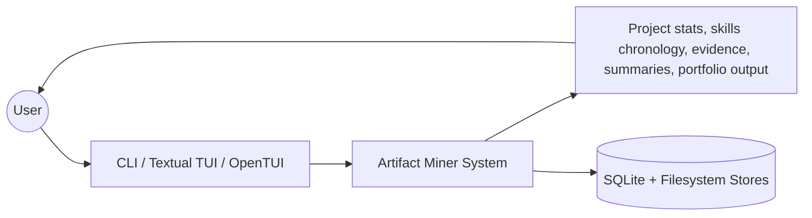
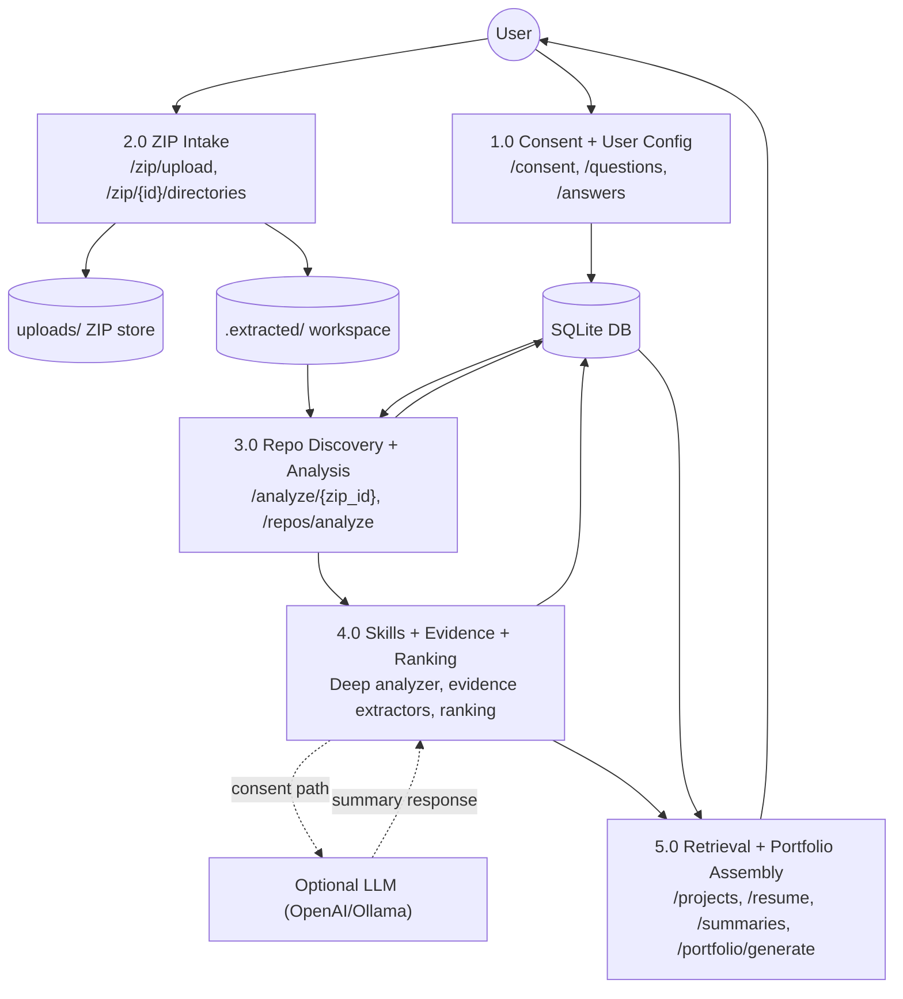

Artifact Miner processes user projects through a five-stage pipeline, from initial consent to final portfolio generation.

## Level 0: System Context

Users interact with Artifact Miner through one of three interfaces. The system analyzes their projects and produces structured outputs including statistics, skills, evidence, and portfolio-ready content. All data is persisted to SQLite and the filesystem.

## Level 1: Detailed Data Flow

## Stage 1: Consent + User Configuration

### Purpose
Capture user consent for LLM usage and gather context for analysis.

### API Endpoints
- `GET /consent` - Retrieve current consent level
- `PUT /consent` - Update consent level and LLM model preference
- `GET /questions` - Fetch configuration questions
- `POST /answers` - Submit user answers
- `GET /useranswer` - Retrieve user's previous answers

### Data Flow

1. **Consent Capture**
   - User selects consent level:
     - `none`: No LLM usage
     - `local`: Local-only processing (Ollama)
     - `local-llm`: Local LLM with some processing
     - `cloud`: Cloud-based LLM (OpenAI)
   - Consent record persisted to `consents` table (models.py:43-50)

2. **User Configuration**
   - System presents questions from `questions` table:
     - Question 1: User email address (for Git attribution)
     - Question 2: Artifacts focus (what files to analyze)
     - Question 3: End goal of analysis
     - Question 4: Repository priority (git vs all files)
     - Question 5: File patterns to include/exclude
   - Answers stored in `user_answers` table (models.py:134-144)

### Database Tables Updated
- `consents` - Consent level and LLM model
- `questions` - Configuration questions (seeded on startup)
- `user_answers` - User responses linked by `question_id`

### Code References
- Consent model: `src/artifactminer/db/models.py:43-50`
- Question model: `src/artifactminer/db/models.py:22-41`
- UserAnswer model: `src/artifactminer/db/models.py:116-144`
- Consent router: `src/artifactminer/api/consent.py`
- User info router: `src/artifactminer/api/user_info.py`

## Stage 2: ZIP Intake

### Purpose
Accept project ZIPs, store them safely, and prepare extraction paths for analysis.

### API Endpoints
- `POST /zip/upload` - Upload a ZIP file
- `GET /zip/{zip_id}/directories` - List directories in uploaded ZIP
- `GET /zip/portfolios/{portfolio_id}` - Retrieve all ZIPs in a portfolio

### Data Flow

1. **Upload Processing**
   - User uploads ZIP file via multipart/form-data
   - File saved to `uploads/` with timestamp prefix: `YYYYMMDD_HHMMSS_{filename}`
   - Optional `portfolio_id` (UUID) links multiple uploads
   - Record created in `uploaded_zips` table (models.py:146-169)

2. **Extraction Preparation**
   - ZIP extracted to `.extracted/{timestamp}_{filename}/`
   - Extraction path stored in `uploaded_zips.extraction_path`
   - Directory tree analyzed for user selection

3. **Portfolio Grouping**
   - Multiple ZIPs can share same `portfolio_id`
   - Enables multi-project portfolio analysis
   - Portfolio preferences stored separately (models.py:279-290)

### Database Tables Updated
- `uploaded_zips` - Metadata for each uploaded ZIP

### Filesystem Changes
- `uploads/{timestamp}_{filename}.zip` - Original ZIP stored
- `.extracted/{timestamp}_{filename}/` - Extracted contents

### Code References
- UploadedZip model: `src/artifactminer/db/models.py:146-169`
- ZIP router: `src/artifactminer/api/zip.py`

## Stage 3: Repository Discovery + Analysis

### Purpose
Find Git repositories in extracted ZIPs and compute repository-level and user-level statistics.

### API Endpoints
- `POST /analyze/{zip_id}` - Analyze all repos in a ZIP
- `POST /repos/analyze` - Analyze specific repository path

### Data Flow

1. **Repository Discovery**
   - Crawl extraction path looking for `.git` directories
   - Check if path is a Git repo using `isGitRepo()` (repo_intelligence_main.py:29-31)
   - Collect all valid Git repositories

2. **Repository Statistics** (via `getRepoStats()`)
   - **Language Detection**: Count file extensions in HEAD commit (repo_intelligence_main.py:143-158)
   - **Framework Detection**: Scan dependency files for framework signatures (framework_detector.py:134-161)
   - **Collaboration Check**: Multiple authors or remotes indicate collaboration (repo_intelligence_main.py:164-167)
   - **Commit Timeline**: Extract first and last commit dates (repo_intelligence_main.py:170-172)
   - **Health Score**: Calculate 0-100 score based on:
     - Documentation (README, LICENSE, etc.): 30 points
     - Commit recency: 25 points
     - Commit activity: 20 points
     - Test presence: 15 points
     - Configuration files: 10 points
   - Saved to `repo_stats` table (models.py:51-81)

3. **User Contribution Statistics** (via `getUserRepoStats()`)
   - Filter commits by user email from question answers
   - Calculate user's contribution percentage (repo_intelligence_user.py:52)
   - Compute commit frequency (commits/week) (repo_intelligence_user.py:54-59)
   - **Activity Classification**: Use `classify_commit_activities()` to break down contributions:
     - Code: Actual code additions
     - Test: Test-related changes
     - Docs: Comments, docstrings, documentation files
     - Config: Configuration and environment files
     - Design: UI/UX-related comments
   - Saved to `user_repo_stats` table (models.py:83-102)

### Database Tables Updated
- `repo_stats` - Repository-level metrics
- `user_repo_stats` - User-scoped contribution metrics

### Code References
- Repository stats: `src/artifactminer/RepositoryIntelligence/repo_intelligence_main.py:134-189`
- User stats: `src/artifactminer/RepositoryIntelligence/repo_intelligence_user.py:32-73`
- Health scoring: `src/artifactminer/RepositoryIntelligence/repo_intelligence_main.py:47-132`
- Activity classifier: `src/artifactminer/RepositoryIntelligence/activity_classifier.py:6-242`
- Framework detection: `src/artifactminer/RepositoryIntelligence/framework_detector.py:134-161`

## Stage 4: Skills + Evidence + Ranking

### Purpose
Extract technical skills from code and Git history, derive higher-order insights, generate evidence, and rank projects.

### Data Flow

1. **Deep Repository Analysis**
   - `DeepRepoAnalyzer` orchestrates skill extraction (deep_analysis.py:22-177)
   - Runs `SkillExtractor.extract_skills()` using multiple signal sources:

2. **Skill Extraction Signals**
   - **Language Signals**: File extension analysis (skill_extractor.py:66-78)
   - **Framework Signals**: Dependency manifest scanning (skill_extractor.py:106-118)
   - **Dependency Signals**: Count occurrences in requirements.txt, package.json, etc. (dependency_signals.py:11-37)
   - **Code Signals**: Regex pattern matching on user additions (code_signals.py:23-31)
   - **File Signals**: File structure patterns
   - **Git Signals**: Branching, tagging, merge patterns (git_signals.py)
   - **Infra Signals**: CI/CD, Docker, environment tools (infra_signals.py)
   - **Repo Quality Signals**: Testing, documentation, linting (repo_quality_signals.py)

3. **Skill Persistence**
   - Skills stored in `skills` table with unique names (models.py:172-184)
   - Project-skill links in `project_skills` table with proficiency scores (models.py:187-206)
   - User-scoped skills in `user_project_skills` for collaborative repos (models.py:208-228)

4. **Insight Derivation**
   - DeepRepoAnalyzer derives insights from skill combinations (deep_analysis.py:157-176)
   - Example insights:
     - "Complexity awareness" from Resource Management skills
     - "Data structure and optimization" from Advanced Collections
     - "API design and architecture" from REST API Design + Dependency Injection
   - Insights mapped to evidence via `insights_to_evidence()` (insight_bridge.py:13-45)

5. **Evidence Generation**
   - Evidence orchestrator collects from multiple bridges:
     - Git stats → `git_stats_to_evidence()` (git_stats_bridge.py:12-39)
     - Repo quality → `repo_quality_to_evidence()` (repo_quality_bridge.py:20-79)
     - Infrastructure → `infra_signals_to_evidence()` (infra_signals_bridge.py:12-37)
     - Insights → `insights_to_evidence()` (insight_bridge.py:13-45)
   - Deduplication prevents duplicate evidence
   - Evidence stored in `project_evidence` table (models.py:262-276)
   - Max 15 auto-generated items per run (orchestrator.py:15)

6. **Project Ranking**
   - Ranking algorithm considers:
     - Repository health score
     - Commit count and recency
     - User contribution percentage
     - Skill diversity and proficiency
   - `ranking_score` saved to `repo_stats.ranking_score` (models.py:69)

7. **AI Summary Generation** (if consent granted)
   - For top-ranked projects, generate summaries via LLM
   - User additions collected via `collect_user_additions()` (repo_intelligence_user.py:93-147)
   - Additions grouped into blocks and sent to LLM
   - Summaries stored in `user_intelligence_summaries` table (models.py:104-113)

### Database Tables Updated
- `skills` - Unique skill catalog
- `project_skills` - Skills detected in each project
- `user_project_skills` - User-scoped skills for collaborative repos
- `project_evidence` - Evidence items supporting skills and insights
- `user_intelligence_summaries` - AI-generated summaries (optional)

### Code References
- DeepRepoAnalyzer: `src/artifactminer/skills/deep_analysis.py:22-177`
- SkillExtractor: `src/artifactminer/skills/skill_extractor.py:16-218`
- Signal extractors: `src/artifactminer/skills/signals/`
- Evidence orchestrator: `src/artifactminer/evidence/orchestrator.py:27-105`
- Evidence bridges: `src/artifactminer/evidence/extractors/`

## Stage 5: Retrieval + Portfolio Assembly

### Purpose
Serve analyzed data through retrieval APIs and assemble portfolio outputs.

### API Endpoints

**Skills & Chronology**
- `GET /skills` - List all detected skills
- `GET /skills/chronology` - Skills timeline ordered by project dates

**Projects & Timeline**
- `GET /projects` - List all projects with stats
- `GET /projects/{project_id}` - Get specific project details
- `GET /projects/timeline` - Chronological project timeline
- `GET /projects/ranking` - Projects ordered by ranking score

**Resume**
- `GET /resume` - List all resume items
- `POST /resume/generate` - Generate resume items from projects
- `POST /resume/{resume_id}/edit` - Edit resume item

**Summaries**
- `GET /summaries` - Template-based project summaries
- `GET /AI_summaries` - LLM-generated summaries (if available)

**Portfolio**
- `POST /portfolio/generate` - Generate portfolio document
- `GET /views/{portfolio_id}/prefs` - Get portfolio representation preferences
- `PUT /views/{portfolio_id}/prefs` - Update portfolio preferences

### Data Flow

1. **Skills Retrieval**
   - Query `skills` joined with `project_skills`
   - Apply proficiency thresholds
   - Order by proficiency or recency

2. **Timeline Generation**
   - Order projects by `first_commit` and `last_commit`
   - Group by time periods (semester, quarter, year)
   - Include skill evolution over time

3. **Resume Item Generation**
   - Extract bullet points from:
     - Project role (from `user_repo_stats.user_role`)
     - Key technologies (from `project_skills`)
     - Evidence items (from `project_evidence`)
     - Activity breakdown (from `user_repo_stats.activity_breakdown`)
   - Store in `resume_items` table (models.py:231-246)

4. **Portfolio Assembly**
   - Collect all projects in a `portfolio_id`
   - Apply representation preferences from `representation_prefs` (models.py:279-290)
   - Generate structured output (JSON or formatted text)
   - Include:
     - Project summaries
     - Skills matrix
     - Timeline
     - Evidence highlights

### Database Tables Queried
- `repo_stats` - Project metadata
- `user_repo_stats` - User contributions
- `skills` + `project_skills` - Skills data
- `project_evidence` - Supporting evidence
- `resume_items` - Resume content
- `representation_prefs` - Portfolio preferences
- `user_intelligence_summaries` - AI summaries

### Code References
- Retrieval router: `src/artifactminer/api/retrieval.py`
- Resume router: `src/artifactminer/api/resume.py`
- Portfolio router: `src/artifactminer/api/portfolio.py`
- Views router: `src/artifactminer/api/views.py`

## Data Flow Summary

| Stage | Input | Processing | Output | Database Tables |
|-------|-------|------------|--------|----------------|
| 1. Consent | User choices | Capture consent & config | Consent record, user answers | `consents`, `questions`, `user_answers` |
| 2. ZIP Intake | ZIP files | Store & extract | File records, extraction paths | `uploaded_zips` |
| 3. Repo Discovery | Extracted files | Find repos, analyze Git history | Repo stats, user stats | `repo_stats`, `user_repo_stats` |
| 4. Skills + Evidence | Code + commits | Signal extraction, insight derivation | Skills, evidence, rankings | `skills`, `project_skills`, `user_project_skills`, `project_evidence` |
| 5. Retrieval | Database queries | Aggregate & format | Timeline, resume, portfolio | All tables (read-only) |

## Related Documentation

- [System Architecture](/architecture/overview)
- [Database Architecture](/architecture/database)
- [Repository Intelligence](/architecture/repository-intelligence)
- [Skill Detection](/architecture/skill-detection)
- [Evidence Extraction](/architecture/evidence-extraction)
