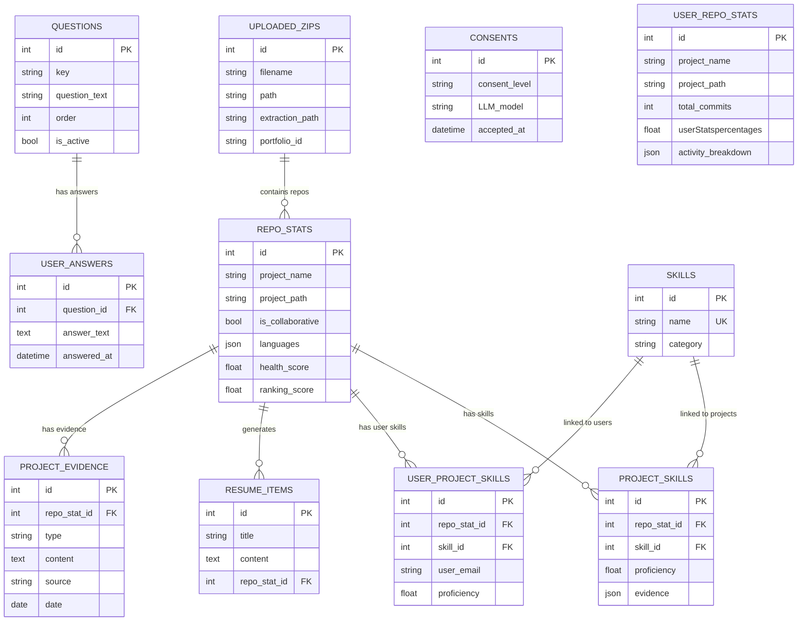

Artifact Miner uses SQLite with SQLAlchemy ORM for all persistent data storage. The database schema is managed through Alembic migrations to ensure safe schema evolution.

## Database Location

- **File**: `artifactminer.db` (created in project root)
- **Engine**: SQLite 3
- **ORM**: SQLAlchemy 2.x
- **Migrations**: Alembic

## Schema Management

### Models Definition

All models are defined in `src/artifactminer/db/models.py`.

Key imports:
```python
from sqlalchemy import Column, Integer, Float, String, DateTime, Date, Boolean, JSON, ForeignKey, Text, UniqueConstraint
from sqlalchemy.orm import relationship
from .database import Base
```

### Alembic Migrations

Migrations are stored in `alembic/versions/` and automatically applied on API startup.

**Apply migrations**:
```bash
uv run alembic upgrade head
```

**Create new migration**:
```bash
uv run alembic revision --autogenerate -m "Description"
```

**Downgrade one revision**:
```bash
uv run alembic downgrade -1
```

**Important**: Always use migrations instead of manually recreating `artifactminer.db`.

## Core Tables

### User Configuration & Consent

#### `questions` Table

Stores configuration questions presented to users.

**Model**: `src/artifactminer/db/models.py:22-41`

| Column | Type | Description |
|--------|------|-------------|
| `id` | Integer | Primary key |
| `key` | String | Stable identifier (e.g., "email", "end_goal") |
| `question_text` | String | Question displayed to user |
| `order` | Integer | Display order |
| `is_active` | Boolean | Whether question is currently used |
| `required` | Boolean | Whether answer is required |
| `answer_type` | String | Type of answer ("text", "email", "choice") |
| `created_at` | DateTime | When question was created |

**Relationships**:
- `answers` → `UserAnswer[]`

**Seeding**: Questions are seeded on API startup when table is empty (see `db/seeders.py`).

#### `user_answers` Table

Stores user responses to configuration questions.

**Model**: `src/artifactminer/db/models.py:116-144`

| Column | Type | Description |
|--------|------|-------------|
| `id` | Integer | Primary key |
| `question_id` | Integer | Foreign key to `questions.id` |
| `answer_text` | Text | User's answer |
| `answered_at` | DateTime | When answer was submitted |

**Relationships**:
- `question` → `Question`

**Common Queries**:
```python
# Get user email (question_id=1)
email_answer = db.query(UserAnswer).filter(UserAnswer.question_id == 1).first()
user_email = email_answer.answer_text if email_answer else None

# Get all user config
answers = db.query(UserAnswer).order_by(UserAnswer.question_id).all()
config = {ans.question_id: ans.answer_text for ans in answers}
```

#### `consents` Table

Tracks user consent for LLM usage.

**Model**: `src/artifactminer/db/models.py:43-50`

| Column | Type | Description |
|--------|------|-------------|
| `id` | Integer | Primary key |
| `consent_level` | String | "none", "local", "local-llm", or "cloud" |
| `LLM_model` | String | "ollama" or "chatGPT" |
| `accepted_at` | DateTime | When consent was granted |

### ZIP Uploads & Portfolios

#### `uploaded_zips` Table

Tracks uploaded ZIP files and their extraction paths.

**Model**: `src/artifactminer/db/models.py:146-169`

| Column | Type | Description |
|--------|------|-------------|
| `id` | Integer | Primary key |
| `filename` | String | Original filename |
| `path` | String | Server filesystem path |
| `uploaded_at` | DateTime | Upload timestamp |
| `extraction_path` | String | Path to extracted contents |
| `portfolio_id` | String | UUID linking multiple ZIPs |

**Portfolio Support**: Multiple ZIPs with the same `portfolio_id` form a portfolio for multi-project analysis.

### Repository Statistics

#### `repo_stats` Table

Repository-level statistics and metadata.

**Model**: `src/artifactminer/db/models.py:51-81`

| Column | Type | Description |
|--------|------|-------------|
| `id` | Integer | Primary key |
| `project_name` | String | Repository name (from directory) |
| `project_path` | String | Filesystem path to repository |
| `is_collaborative` | Boolean | Multiple authors or remotes detected |
| `languages` | JSON | List of file extensions/languages |
| `language_percentages` | JSON | Percentage breakdown by language |
| `primary_language` | String | Most common language |
| `first_commit` | DateTime | Earliest commit date |
| `last_commit` | DateTime | Most recent commit date |
| `total_commits` | Integer | Total commit count |
| `frameworks` | JSON | Detected frameworks (Django, React, etc.) |
| `collaboration_metadata` | JSON | Collaboration statistics |
| `ranking_score` | Float | Project ranking (higher = more impressive) |
| `ranked_at` | DateTime | When ranking was calculated |
| `deleted_at` | DateTime | Soft delete timestamp |
| `health_score` | Float | Repository health (0-100) |
| `thumbnail_url` | String | Project thumbnail path or URL |
| `created_at` | DateTime | When record was created |

**Relationships**:
- `project_skills` → `ProjectSkill[]`
- `user_project_skills` → `UserProjectSkill[]`
- `resume_items` → `ResumeItem[]`
- `evidence` → `ProjectEvidence[]`

**Populated by**: `getRepoStats()` in `src/artifactminer/RepositoryIntelligence/repo_intelligence_main.py:134-189`

#### `user_repo_stats` Table

User-specific contribution statistics for each repository.

**Model**: `src/artifactminer/db/models.py:83-102`

| Column | Type | Description |
|--------|------|-------------|
| `id` | Integer | Primary key |
| `project_name` | String | Repository name |
| `project_path` | String | Filesystem path |
| `first_commit` | DateTime | User's first commit |
| `last_commit` | DateTime | User's last commit |
| `total_commits` | Integer | User's commit count |
| `userStatspercentages` | Float | User's contribution % |
| `commitFrequency` | Float | Commits per week |
| `activity_breakdown` | JSON | Activity classification (code, test, docs, config, design) |
| `user_role` | String | User's role (e.g., "Lead Developer") |
| `created_at` | DateTime | When record was created |

**Populated by**: `getUserRepoStats()` in `src/artifactminer/RepositoryIntelligence/repo_intelligence_user.py:32-73`

**Activity Breakdown Format** (JSON):
```json
{
  "code": {"commits": 10, "lines_added": 500, "percentage": 60},
  "test": {"commits": 3, "lines_added": 150, "percentage": 18},
  "docs": {"commits": 2, "lines_added": 100, "percentage": 12},
  "config": {"commits": 1, "lines_added": 50, "percentage": 6},
  "design": {"commits": 1, "lines_added": 33, "percentage": 4}
}
```

### Skills

#### `skills` Table

Global catalog of all detected skills.

**Model**: `src/artifactminer/db/models.py:172-184`

| Column | Type | Description |
|--------|------|-------------|
| `id` | Integer | Primary key |
| `name` | String | Skill name (unique) |
| `category` | String | Skill category (languages, frameworks, tools, etc.) |
| `created_at` | DateTime | When skill was first detected |

**Relationships**:
- `project_skills` → `ProjectSkill[]`
- `user_project_skills` → `UserProjectSkill[]`

**Example skills**: Python, React, Docker, REST API Design, Test-Driven Development

#### `project_skills` Table

Links skills to projects with proficiency scores and evidence.

**Model**: `src/artifactminer/db/models.py:187-206`

| Column | Type | Description |
|--------|------|-------------|
| `id` | Integer | Primary key |
| `repo_stat_id` | Integer | Foreign key to `repo_stats.id` |
| `skill_id` | Integer | Foreign key to `skills.id` |
| `weight` | Float | Skill weight/importance |
| `proficiency` | Float | Proficiency level (0.0-1.0) |
| `evidence` | JSON | Evidence snippets supporting skill |
| `created_at` | DateTime | When link was created |

**Constraints**: Unique constraint on `(repo_stat_id, skill_id)`

**Relationships**:
- `repo_stat` → `RepoStat`
- `skill` → `Skill`

#### `user_project_skills` Table

User-scoped skills for collaborative repositories.

**Model**: `src/artifactminer/db/models.py:208-228`

| Column | Type | Description |
|--------|------|-------------|
| `id` | Integer | Primary key |
| `repo_stat_id` | Integer | Foreign key to `repo_stats.id` |
| `skill_id` | Integer | Foreign key to `skills.id` |
| `user_email` | String | User's email (for attribution) |
| `proficiency` | Float | User's proficiency (0.0-1.0) |
| `evidence` | JSON | User-specific evidence |
| `created_at` | DateTime | When link was created |

**Constraints**: Unique constraint on `(repo_stat_id, skill_id, user_email)`

**Relationships**:
- `repo_stat` → `RepoStat`
- `skill` → `Skill`

**Purpose**: In collaborative repos, skills are attributed only to the user who demonstrated them.

### Evidence

#### `project_evidence` Table

Structured evidence items supporting project skills and insights.

**Model**: `src/artifactminer/db/models.py:262-276`

| Column | Type | Description |
|--------|------|-------------|
| `id` | Integer | Primary key |
| `repo_stat_id` | Integer | Foreign key to `repo_stats.id` |
| `type` | String | Evidence type (metric, testing, documentation, evaluation, etc.) |
| `content` | Text | Evidence description |
| `source` | String | Source of evidence (git_stats, repo_quality_signals, etc.) |
| `date` | Date | Date associated with evidence |
| `created_at` | DateTime | When evidence was created |

**Relationships**:
- `repo_stat` → `RepoStat`

**Evidence Types**:
- `metric` - Quantitative metrics (commit count, contribution %, etc.)
- `testing` - Test coverage and frameworks
- `documentation` - Documentation presence
- `code_quality` - Linting, type checking, etc.
- `evaluation` - Derived insights

**Example Evidence Items**:
```python
EvidenceItem(type="metric", content="Contributed 65.3% of repository commits", source="git_stats")
EvidenceItem(type="testing", content="Has 42 test files (pytest)", source="repo_quality_signals")
EvidenceItem(type="evaluation", content="API design and architecture: Clean API design with validation and DI shows architectural maturity.", source="insight")
```

**Populated by**: Evidence orchestrator in `src/artifactminer/evidence/orchestrator.py:27-105`

### Resume & Portfolio

#### `resume_items` Table

Generated resume bullet points for projects.

**Model**: `src/artifactminer/db/models.py:231-246`

| Column | Type | Description |
|--------|------|-------------|
| `id` | Integer | Primary key |
| `title` | String | Item title |
| `content` | Text | Resume bullet point |
| `category` | String | Category (experience, projects, etc.) |
| `repo_stat_id` | Integer | Foreign key to `repo_stats.id` |
| `created_at` | DateTime | When item was created |

**Relationships**:
- `repo_stat` → `RepoStat`

#### `representation_prefs` Table

Stores representation preferences per portfolio.

**Model**: `src/artifactminer/db/models.py:279-290`

| Column | Type | Description |
|--------|------|-------------|
| `portfolio_id` | String | Primary key (UUID) |
| `prefs_json` | Text | JSON preferences |
| `updated_at` | DateTime | Last update timestamp |

**Purpose**: Allows users to customize how each portfolio is represented (which projects to highlight, formatting preferences, etc.).

### AI Summaries

#### `user_intelligence_summaries` Table

LLM-generated summaries of user contributions.

**Model**: `src/artifactminer/db/models.py:104-113`

| Column | Type | Description |
|--------|------|-------------|
| `id` | Integer | Primary key |
| `repo_path` | String | Repository path |
| `user_email` | String | User's email |
| `summary_text` | Text | Generated summary |
| `generated_at` | DateTime | When summary was created |

**Populated by**: `generate_summaries_for_ranked()` in `src/artifactminer/RepositoryIntelligence/repo_intelligence_user.py:210-330`

**Consent Gated**: Only populated when user grants LLM consent.

### Legacy Tables

#### `artifacts` Table

Basic artifact tracking (legacy, may be deprecated).

**Model**: `src/artifactminer/db/models.py:8-19`

| Column | Type | Description |
|--------|------|-------------|
| `id` | Integer | Primary key |
| `name` | String | Artifact name |
| `path` | String | Filesystem path (unique) |
| `type` | String | "file" or "directory" |
| `scanned_at` | DateTime | Scan timestamp |

#### `exports` Table

Export job tracking.

**Model**: `src/artifactminer/db/models.py:249-259`

| Column | Type | Description |
|--------|------|-------------|
| `id` | Integer | Primary key |
| `export_type` | String | Type of export |
| `path` | String | Output path |
| `status` | String | "pending", "completed", "failed" |
| `created_at` | DateTime | Creation timestamp |
| `completed_at` | DateTime | Completion timestamp |

## Entity Relationship Diagram



## Database Access Patterns

### Session Management

```python
from artifactminer.db.database import SessionLocal, get_db

# Direct session usage
db = SessionLocal()
try:
    # queries here
    db.commit()
finally:
    db.close()

# FastAPI dependency injection
from fastapi import Depends
from sqlalchemy.orm import Session

@app.get("/endpoint")
def endpoint(db: Session = Depends(get_db)):
    # db is automatically managed
    pass
```

### Common Query Patterns

**Get user email**:
```python
email_answer = db.query(UserAnswer).filter(UserAnswer.question_id == 1).first()
user_email = email_answer.answer_text if email_answer else None
```

**Get top-ranked projects**:
```python
top_projects = db.query(RepoStat).order_by(RepoStat.ranking_score.desc()).limit(5).all()
```

**Get skills for a project**:
```python
project_skills = (
    db.query(Skill)
    .join(ProjectSkill)
    .filter(ProjectSkill.repo_stat_id == project_id)
    .all()
)
```

**Get evidence for a project**:
```python
evidence_items = (
    db.query(ProjectEvidence)
    .filter(ProjectEvidence.repo_stat_id == project_id)
    .order_by(ProjectEvidence.created_at.desc())
    .all()
)
```

## Best Practices

1. **Always use migrations**: Never manually edit `artifactminer.db`
2. **Use relationships**: Leverage SQLAlchemy relationships for joins
3. **Avoid N+1 queries**: Use `joinedload()` or `selectinload()` for eager loading
4. **Respect unique constraints**: Check before inserting skills or project_skills
5. **Use UTC timestamps**: All datetime columns use UTC (via `datetime.now(UTC).replace(tzinfo=None)`)
6. **Soft deletes**: Use `deleted_at` instead of hard deletes for repos
7. **JSON validation**: Validate JSON structure before persisting to JSON columns

## Related Documentation

- [System Architecture](/architecture/overview)
- [Data Flow Architecture](/architecture/data-flow)
- [Repository Intelligence](/architecture/repository-intelligence)
- [Skill Detection](/architecture/skill-detection)
- [Evidence Extraction](/architecture/evidence-extraction)
