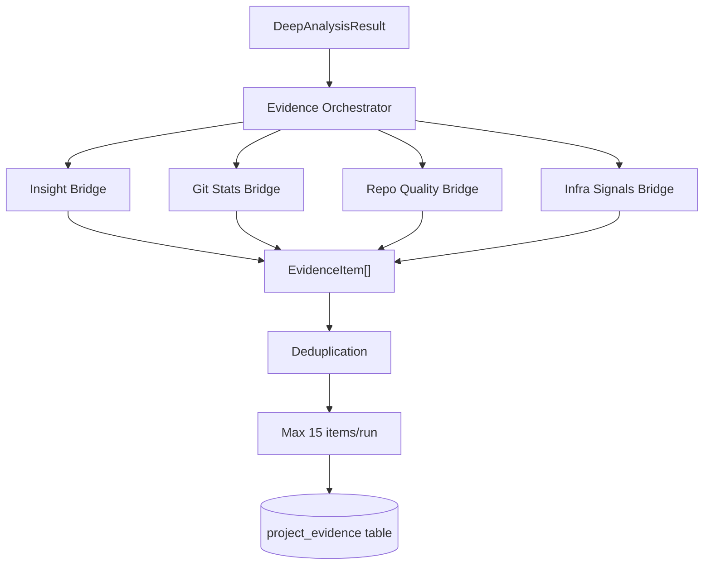

The Evidence Extraction system converts analysis results (skills, insights, Git stats, infrastructure signals, and quality metrics) into structured evidence items that support resume and portfolio generation.

## Module Location

`src/artifactminer/evidence/`

## Architecture Overview



## Evidence Model

**File**: `models.py`

**Location**: `src/artifactminer/evidence/models.py:9-17`

### EvidenceItem Dataclass

```python
@dataclass
class EvidenceItem:
    """Structured evidence item ready for ProjectEvidence persistence."""
    
    type: str  # Evidence type: "metric", "testing", "documentation", "evaluation", etc.
    content: str  # Evidence description
    source: str | None = None  # Source: "git_stats", "repo_quality_signals", "insight", etc.
    date: date | None = None  # Associated date (typically last commit date)
```

**Evidence Types**:
- `metric`: Quantitative metrics (commit counts, contribution %, frequency)
- `testing`: Test coverage, frameworks, file counts
- `documentation`: Documentation presence and quality
- `code_quality`: Linting, type checking, pre-commit hooks
- `evaluation`: Derived insights and architectural assessments
- `test_coverage`: Test-related gaps or issues

**Example Evidence Items**:
```python
EvidenceItem(
    type="metric",
    content="Contributed 65.3% of repository commits",
    source="git_stats",
    date=date(2025, 3, 5)
)

EvidenceItem(
    type="testing",
    content="Has 42 test files (pytest)",
    source="repo_quality_signals",
    date=date(2025, 3, 5)
)

EvidenceItem(
    type="evaluation",
    content="API design and architecture: Clean API design with validation and DI shows architectural maturity.",
    source="async def create_app; @dataclass; @app.post",
    date=date(2025, 3, 5)
)
```

## Evidence Bridges

Bridges convert analysis results into `EvidenceItem` lists.

### 1. Insight Bridge

**File**: `extractors/insight_bridge.py`

**Function**: `insights_to_evidence(insights, repo_last_commit=None)`

**Location**: `src/artifactminer/evidence/extractors/insight_bridge.py:13-45`

**Purpose**: Convert `Insight` objects from DeepRepoAnalyzer into evidence items.

**Process**:
```python
def insights_to_evidence(
    insights: Iterable[Insight],
    *,
    repo_last_commit: date | datetime | None = None,
) -> list[EvidenceItem]:
    converted: list[EvidenceItem] = []
    evidence_date = coerce_date(repo_last_commit)
    
    for insight in insights:
        title = (insight.title or "").strip()
        why = (insight.why_it_matters or "").strip()
        
        if not title and not why:
            continue
        
        # Combine title and rationale
        if title and why:
            content = f"{title}: {why}"
        else:
            content = title or why
        
        # Use first 5 evidence snippets as source
        source_chunks = [item.strip() for item in (insight.evidence or []) if item and item.strip()]
        source = "; ".join(source_chunks[:5]) if source_chunks else None
        
        converted.append(
            EvidenceItem(
                type="evaluation",
                content=content,
                source=source,
                date=evidence_date,
            )
        )
    
    return converted
```

**Example Transformation**:

**Input Insight**:
```python
Insight(
    title="API design and architecture",
    evidence=[
        "Uses async/await patterns (5 matches)",
        "Defines REST API endpoints (12 matches)",
        "Uses dependency injection (3 matches)"
    ],
    why_it_matters="Clean API design with validation and DI shows architectural maturity."
)
```

**Output Evidence**:
```python
EvidenceItem(
    type="evaluation",
    content="API design and architecture: Clean API design with validation and DI shows architectural maturity.",
    source="Uses async/await patterns (5 matches); Defines REST API endpoints (12 matches); Uses dependency injection (3 matches)",
    date=date(2025, 3, 5)
)
```

### 2. Git Stats Bridge

**File**: `extractors/git_stats_bridge.py`

**Function**: `git_stats_to_evidence(git_stats)`

**Location**: `src/artifactminer/evidence/extractors/git_stats_bridge.py:12-39`

**Purpose**: Convert `GitStatsResult` into evidence items.

**Process**:
```python
def git_stats_to_evidence(git_stats: GitStatsResult) -> List[EvidenceItem]:
    if not git_stats:
        return []
    
    evidence_date = coerce_date(git_stats.last_commit_date)
    items: List[EvidenceItem] = []
    
    # Define rules: (condition, content, source)
    _RULES = [
        (git_stats.contribution_percent > 0,
         f"Contributed {git_stats.contribution_percent:.1f}% of repository commits",
         "git_stats"),
        
        (git_stats.commit_frequency > 0,
         f"Commit frequency: {git_stats.commit_frequency:.2f} commits/week",
         "git_stats"),
        
        (git_stats.commit_count_window > 0,
         f"{git_stats.commit_count_window} commits in last 90 days",
         "git_stats"),
        
        (git_stats.has_branches and git_stats.branch_count > 1,
         f"Uses branching workflow ({git_stats.branch_count} branches)",
         "git_patterns"),
        
        (git_stats.has_tags,
         "Uses git tags for releases",
         "git_patterns"),
        
        (git_stats.merge_commits > 0,
         f"Performed {git_stats.merge_commits} merge commits",
         "git_patterns"),
    ]
    
    for condition, content, source in _RULES:
        if condition:
            items.append(EvidenceItem(
                type="metric",
                content=content,
                source=source,
                date=evidence_date
            ))
    
    return items
```

**Example Output**:
```python
[
    EvidenceItem(type="metric", content="Contributed 65.3% of repository commits", source="git_stats"),
    EvidenceItem(type="metric", content="Commit frequency: 3.45 commits/week", source="git_stats"),
    EvidenceItem(type="metric", content="15 commits in last 90 days", source="git_stats"),
    EvidenceItem(type="metric", content="Uses branching workflow (5 branches)", source="git_patterns"),
    EvidenceItem(type="metric", content="Uses git tags for releases", source="git_patterns"),
]
```

### 3. Repo Quality Bridge

**File**: `extractors/repo_quality_bridge.py`

**Function**: `repo_quality_to_evidence(quality, evidence_date=None)`

**Location**: `src/artifactminer/evidence/extractors/repo_quality_bridge.py:20-79`

**Purpose**: Convert `RepoQualityResult` into evidence items.

**Process**:

#### Positive Signals

**Testing** (lines 32-39):
```python
if quality.has_tests and quality.test_file_count > 0:
    frameworks = ", ".join(quality.test_frameworks) if quality.test_frameworks else "tests"
    items.append(EvidenceItem(
        type="testing",
        content=f"Has {quality.test_file_count} test files ({frameworks})",
        source="repo_quality_signals",
        date=evidence_date,
    ))
```

**Documentation** (lines 42-49):
```python
docs_parts = [label for attr, label in _DOCS_FLAGS if getattr(quality, attr)]
if docs_parts:
    items.append(EvidenceItem(
        type="documentation",
        content=f"Has documentation: {', '.join(docs_parts)}",
        source="repo_quality_signals",
        date=evidence_date,
    ))
```

Where `_DOCS_FLAGS` is:
```python
_DOCS_FLAGS = [
    ("has_readme", "README"),
    ("has_changelog", "CHANGELOG"),
    ("has_contributing", "CONTRIBUTING"),
    ("has_docs_dir", "docs/"),
]
```

**Quality Tooling** (lines 52-60):
```python
quality_parts = [label for attr, label in _QUALITY_FLAGS if getattr(quality, attr)]
if quality_parts:
    content = f"Has quality tooling: {', '.join(quality_parts)}"
    if quality.quality_tools:
        content += f" ({', '.join(quality.quality_tools)})"
    items.append(EvidenceItem(
        type="code_quality",
        content=content,
        source="repo_quality_signals",
        date=evidence_date,
    ))
```

Where `_QUALITY_FLAGS` is:
```python
_QUALITY_FLAGS = [
    ("has_lint_config", "lint"),
    ("has_precommit", "pre-commit"),
    ("has_type_check", "type checking")
]
```

#### Negative Signals

**Missing Tests** (lines 63-69):
```python
if not quality.has_tests:
    items.append(EvidenceItem(
        type="test_coverage",
        content="No test files detected in repository",
        source="repo_quality_signals",
        date=evidence_date,
    ))
```

**Missing Documentation** (lines 71-77):
```python
if not docs_parts:
    items.append(EvidenceItem(
        type="documentation",
        content="Documentation is missing.",
        source="docs_signals",
        date=evidence_date,
    ))
```

**Example Output**:
```python
[
    EvidenceItem(type="testing", content="Has 42 test files (pytest)", source="repo_quality_signals"),
    EvidenceItem(type="documentation", content="Has documentation: README, LICENSE, CHANGELOG", source="repo_quality_signals"),
    EvidenceItem(type="code_quality", content="Has quality tooling: lint, type checking (pylint, mypy)", source="repo_quality_signals"),
]
```

### 4. Infra Signals Bridge

**File**: `extractors/infra_signals_bridge.py`

**Function**: `infra_signals_to_evidence(infra_signals, evidence_date=None)`

**Location**: `src/artifactminer/evidence/extractors/infra_signals_bridge.py:12-37`

**Purpose**: Convert `InfraSignalsResult` into evidence items.

**Process**:
```python
def infra_signals_to_evidence(
    infra_signals: InfraSignalsResult,
    *,
    evidence_date: date | None = None,
) -> List[EvidenceItem]:
    if not infra_signals or not infra_signals.all_tools:
        return []
    
    items: List[EvidenceItem] = []
    _CATEGORIES = [
        (infra_signals.ci_cd_tools, "CI/CD"),
        (infra_signals.docker_tools, "Containerization"),
        (infra_signals.env_build_tools, "Build/Deploy tools"),
    ]
    
    for tools, label in _CATEGORIES:
        if tools:
            items.append(EvidenceItem(
                type="metric",
                content=f"{label}: {', '.join(sorted(set(tools)))}",
                source="infra_signals",
                date=evidence_date,
            ))
    
    return items
```

**Example Output**:
```python
[
    EvidenceItem(type="metric", content="CI/CD: .github/workflows/, .gitlab-ci.yml", source="infra_signals"),
    EvidenceItem(type="metric", content="Containerization: Dockerfile, docker-compose.yml", source="infra_signals"),
    EvidenceItem(type="metric", content="Build/Deploy tools: Makefile, webpack.config.js", source="infra_signals"),
]
```

## Evidence Orchestrator

**File**: `orchestrator.py`

**Location**: `src/artifactminer/evidence/orchestrator.py`

### Core Functions

#### persist_generated_evidence()

**Signature**:
```python
def persist_generated_evidence(
    db: Session,
    repo_stat_id: int,
    evidence_items: Iterable[EvidenceItem],
    *,
    max_items: int = MAX_AUTOGENERATED_EVIDENCE_PER_RUN,
    commit: bool = True,
) -> list[ProjectEvidence]
```

**Location**: Lines 27-82

**Constants**:
```python
MAX_AUTOGENERATED_EVIDENCE_PER_RUN = 15  # Line 15
```

**Process**:

1. **Validation** (lines 36-44):
   ```python
   if not isinstance(db, Session):
       raise ValueError("db must be a SQLAlchemy Session")
   if max_items < 0:
       raise ValueError("max_items must be >= 0")
   if max_items == 0:
       return []
   
   if not db.query(RepoStat).filter(RepoStat.id == repo_stat_id).first():
       raise ValueError(f"RepoStat {repo_stat_id} does not exist")
   ```

2. **Load Existing Evidence** (lines 46-51):
   ```python
   existing_rows = (
       db.query(ProjectEvidence.type, ProjectEvidence.content)
       .filter(ProjectEvidence.repo_stat_id == repo_stat_id)
       .all()
   )
   seen_keys = {_evidence_key(item_type, content) for item_type, content in existing_rows}
   ```

3. **Deduplication** (lines 18-24, 54-77):
   ```python
   def _normalize_token(value: str) -> str:
       """Normalize for case/whitespace-insensitive dedupe comparisons."""
       return " ".join(value.strip().split()).lower()
   
   def _evidence_key(item_type: str, content: str) -> tuple[str, str]:
       return (_normalize_token(item_type), _normalize_token(content))
   
   # In loop:
   dedupe_key = _evidence_key(item_type, content)
   if dedupe_key in seen_keys:
       continue  # Skip duplicate
   seen_keys.add(dedupe_key)
   ```

4. **Insert with Cap** (lines 54-77):
   ```python
   created: list[ProjectEvidence] = []
   for item in evidence_items:
       if len(created) >= max_items:
           break  # Stop at max_items
       
       item_type = (item.type or "").strip()
       content = (item.content or "").strip()
       if not item_type or not content:
           continue  # Skip empty items
       
       dedupe_key = _evidence_key(item_type, content)
       if dedupe_key in seen_keys:
           continue
       seen_keys.add(dedupe_key)
       
       source = (item.source or "").strip() or None
       row = ProjectEvidence(
           repo_stat_id=repo_stat_id,
           type=item_type,
           content=content,
           source=source,
           date=item.date,
       )
       db.add(row)
       created.append(row)
   ```

5. **Commit** (lines 79-81):
   ```python
   if commit:
       db.commit()
   
   return created
   ```

**Deduplication Logic**:
- Case-insensitive comparison
- Whitespace normalized (multiple spaces → single space)
- Key: `(normalized_type, normalized_content)`
- Example:
  - `"Testing"` + `"Has 42 test files"` = same as
  - `"testing"` + `"  Has   42   test files  "`

**Insertion Cap**:
- Default: 15 items per run
- Prevents evidence table from growing too large
- Favors items appearing earlier in the input list

#### persist_insights_as_project_evidence()

**Signature**:
```python
def persist_insights_as_project_evidence(
    db: Session,
    repo_stat_id: int,
    insights: list[Insight],
    *,
    repo_last_commit: date | datetime | None = None,
    max_items: int = MAX_AUTOGENERATED_EVIDENCE_PER_RUN,
    commit: bool = True,
) -> list[ProjectEvidence]
```

**Location**: Lines 85-105

**Process**:
```python
def persist_insights_as_project_evidence(
    db: Session,
    repo_stat_id: int,
    insights: list[Insight],
    *,
    repo_last_commit: date | datetime | None = None,
    max_items: int = MAX_AUTOGENERATED_EVIDENCE_PER_RUN,
    commit: bool = True,
) -> list[ProjectEvidence]:
    """Convert insights to evidence rows and persist with dedupe/cap rules."""
    evidence_items = insights_to_evidence(
        insights,
        repo_last_commit=repo_last_commit,
    )
    return persist_generated_evidence(
        db=db,
        repo_stat_id=repo_stat_id,
        evidence_items=evidence_items,
        max_items=max_items,
        commit=commit,
    )
```

**Convenience wrapper** that:
1. Converts insights to evidence items
2. Persists with deduplication and capping

## Complete Evidence Pipeline

### Example Usage

```python
from artifactminer.skills.deep_analysis import DeepRepoAnalyzer
from artifactminer.evidence.orchestrator import persist_generated_evidence
from artifactminer.evidence.extractors import (
    insights_to_evidence,
    git_stats_to_evidence,
    repo_quality_to_evidence,
    infra_signals_to_evidence,
)
from artifactminer.RepositoryIntelligence.repo_intelligence_main import getRepoStats
from sqlalchemy.orm import Session

# 1. Analyze repository
repo_stat = getRepoStats("/path/to/repo")
analyzer = DeepRepoAnalyzer()
result = analyzer.analyze(
    repo_path="/path/to/repo",
    repo_stat=repo_stat,
    user_email="alice@example.com",
)

# 2. Convert analysis results to evidence items
evidence_items = []

# From insights
evidence_items.extend(insights_to_evidence(
    result.insights,
    repo_last_commit=repo_stat.last_commit,
))

# From git stats
if result.git_stats:
    evidence_items.extend(git_stats_to_evidence(result.git_stats))

# From repo quality
if result.repo_quality:
    evidence_items.extend(repo_quality_to_evidence(
        result.repo_quality,
        evidence_date=repo_stat.last_commit,
    ))

# From infra signals
if result.infra_signals:
    evidence_items.extend(infra_signals_to_evidence(
        result.infra_signals,
        evidence_date=repo_stat.last_commit,
    ))

# 3. Persist to database
db: Session = get_db()
persisted = persist_generated_evidence(
    db=db,
    repo_stat_id=repo_stat.id,
    evidence_items=evidence_items,
    max_items=15,
    commit=True,
)

print(f"Persisted {len(persisted)} evidence items")
for item in persisted:
    print(f"  [{item.type}] {item.content}")
```

### Output Example

```
Persisted 12 evidence items
  [evaluation] API design and architecture: Clean API design with validation and DI shows architectural maturity.
  [evaluation] Robustness and error handling: Custom exceptions, managed resources, and logging reduce brittleness.
  [metric] Contributed 65.3% of repository commits
  [metric] Commit frequency: 3.45 commits/week
  [metric] 15 commits in last 90 days
  [metric] Uses branching workflow (5 branches)
  [testing] Has 42 test files (pytest)
  [documentation] Has documentation: README, LICENSE, CHANGELOG
  [code_quality] Has quality tooling: lint, type checking (pylint, mypy)
  [metric] CI/CD: .github/workflows/
  [metric] Containerization: Dockerfile, docker-compose.yml
  [metric] Build/Deploy tools: Makefile
```

## Database Schema

**Table**: `project_evidence`

**Model**: `src/artifactminer/db/models.py:262-276`

```python
class ProjectEvidence(Base):
    __tablename__ = "project_evidence"
    
    id = Column(Integer, primary_key=True, index=True)
    repo_stat_id = Column(Integer, ForeignKey("repo_stats.id", ondelete="CASCADE"), nullable=False)
    type = Column(String, nullable=False)
    content = Column(Text, nullable=False)
    source = Column(String, nullable=True)
    date = Column(Date, nullable=True)
    created_at = Column(DateTime, default=lambda: datetime.now(UTC).replace(tzinfo=None))
    
    # Relationships
    repo_stat = relationship("RepoStat", back_populates="evidence")
```

## Evidence Retrieval

Evidence is retrieved via the projects router:

**Endpoint**: `GET /projects/{project_id}/evidence`

**Query**:
```python
evidence_items = (
    db.query(ProjectEvidence)
    .filter(ProjectEvidence.repo_stat_id == project_id)
    .order_by(ProjectEvidence.created_at.desc())
    .all()
)
```

**Usage**:
- Resume generation: Pull evidence as bullet points
- Portfolio generation: Highlight top evidence items
- Skill validation: Evidence supports claimed skills

## Best Practices

1. **Always use bridges**: Don't create `EvidenceItem` directly from analysis results
2. **Respect the cap**: 15 items is usually sufficient; prioritize high-value evidence
3. **Deduplicate**: Orchestrator handles this, but be mindful of content variations
4. **Include dates**: Associate evidence with repo's last commit date for timeline context
5. **Validate sources**: Source field helps trace evidence origin for debugging
6. **Handle missing data**: Bridges gracefully handle None/missing analysis results

## Related Documentation

- [System Architecture](/architecture/overview)
- [Data Flow Architecture](/architecture/data-flow)
- [Database Architecture](/architecture/database)
- [Repository Intelligence](/architecture/repository-intelligence)
- [Skill Detection](/architecture/skill-detection)
