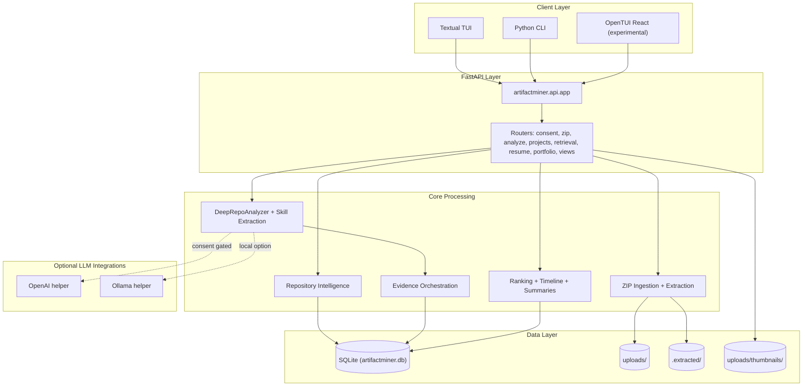

Artifact Miner is a multi-layered system that analyzes uploaded project ZIPs, discovers Git repositories, extracts intelligence about repositories and user contributions, derives skills and evidence, and generates resume and portfolio outputs.

## Architecture Layers

The system is organized into five distinct layers:

### 1. Client Layer

Artifact Miner provides three client interfaces:

- **Textual TUI**: Interactive terminal user interface built with Textual framework
  - Located in `src/artifactminer/tui/`
  - Provides screens for consent, user configuration, ZIP upload, directory selection, and resume views
  - Primary interface for CS students and TAs

- **Python CLI**: Command-line interface for batch processing
  - Located in `src/artifactminer/cli/`
  - Supports interactive and non-interactive modes
  - Exports reports in `.txt` or `.json` formats
  - Example: `artifactminer -i projects.zip -o report.txt -c no_llm -u user@example.com`

- **OpenTUI React (Experimental)**: Web-based client
  - Located in `opentui-react-exp/`
  - Provides modern web interface using React and OpenTUI
  - Currently experimental

### 2. API Layer (FastAPI)

The backend API is built with FastAPI and provides RESTful endpoints for all system operations.

**Main Application**: `src/artifactminer/api/app.py`

The API includes these routers:

- **Consent Router** (`consent.py`): Manages consent levels (none, local, local-llm, cloud) and LLM model selection
- **ZIP Router** (`zip.py`): Handles ZIP file uploads, directory listing, and portfolio grouping
- **Analyze Router** (`analyze.py`): Orchestrates repository discovery and analysis workflows
- **Projects Router** (`projects.py`): CRUD operations for projects, thumbnails, roles, timeline, and ranking
- **Retrieval Router** (`retrieval.py`): Serves skills, chronology, summaries, and timeline data
- **Resume Router** (`resume.py`): Generates and manages resume items
- **Portfolio Router** (`portfolio.py`): Assembles multi-project portfolio outputs with representation preferences
- **Views Router** (`views.py`): Manages portfolio representation preferences
- **User Info Router** (`user_info.py`): Handles user configuration questions and answers
- **Crawler Router** (`crawler.py`): Directory and file system operations
- **File Intelligence Router** (`file_intelligence.py`): File-level analysis and insights
- **OpenAI Router** (`openai.py`): LLM integration endpoints

### 3. Core Processing Layer

This layer contains the business logic for analyzing repositories and extracting intelligence:

#### ZIP Ingestion & Extraction
- Stores uploaded ZIPs in `uploads/` directory
- Extracts contents to `.extracted/` workspace
- Manages portfolio-scoped analysis (multiple ZIPs linked by `portfolio_id`)

#### Repository Intelligence (`RepositoryIntelligence/`)
- **`repo_intelligence_main.py`**: Repository-level statistics and metrics
- **`repo_intelligence_user.py`**: User-scoped contribution analysis
- **`framework_detector.py`**: Framework detection from dependency files
- **`activity_classifier.py`**: Classifies commits into activity types (code, test, docs, config, design)

#### Skill Extraction (`skills/`)
- **`deep_analysis.py`**: DeepRepoAnalyzer orchestrates skill extraction and insight generation
- **`skill_extractor.py`**: SkillExtractor uses heuristics to identify technical skills
- **`skill_patterns.py`**: Regex patterns and rules for skill detection
- **Signal Extractors** (`signals/`):
  - `code_signals.py`: Regex-based code pattern detection
  - `dependency_signals.py`: Dependency manifest analysis
  - `file_signals.py`: File structure analysis
  - `git_signals.py`: Git workflow patterns (branching, tagging, merges)
  - `infra_signals.py`: Infrastructure and DevOps tooling
  - `repo_quality_signals.py`: Testing, documentation, and quality metrics

#### Evidence Extraction (`evidence/`)
- **`orchestrator.py`**: Coordinates evidence persistence with deduplication
- **Evidence Bridges** (`extractors/`):
  - `git_stats_bridge.py`: Converts git metrics to evidence items
  - `repo_quality_bridge.py`: Converts quality signals to evidence
  - `insight_bridge.py`: Converts insights to evidence records
  - `infra_signals_bridge.py`: Converts infrastructure signals to evidence

#### Ranking & Summaries
- Repository ranking based on health score, commit activity, and collaboration
- Timeline generation for chronological project views
- AI-powered summaries (when consent is granted)

### 4. Integration Layer (Optional LLM)

Artifact Miner supports optional LLM integrations:

- **OpenAI Helper**: Cloud-based LLM for generating summaries and insights
- **Ollama Helper**: Local LLM option for privacy-conscious users
- **Consent-Gated**: All LLM features respect user consent settings

LLM integrations are used for:
- Generating natural language summaries of user contributions
- Enhancing skill descriptions with context
- Creating portfolio narratives

### 5. Data Layer

The data layer consists of:

#### SQLite Database (`artifactminer.db`)
- SQLAlchemy ORM models in `src/artifactminer/db/models.py`
- Alembic migrations in `alembic/versions/`
- Stores all structured data (see [Database Architecture](/architecture/database))

#### File System Storage
- **`uploads/`**: Original ZIP files uploaded by users
- **`.extracted/`**: Extracted workspace for repository analysis
- **`uploads/thumbnails/`**: Project thumbnail images

## System Architecture Diagram

## Key Design Principles

### 1. Privacy-First Architecture
- All LLM integrations are consent-gated
- Local-only analysis available (no cloud dependencies)
- User controls data sharing at multiple levels

### 2. Multi-Project Portfolio Support
- Multiple ZIPs can be linked via `portfolio_id`
- Projects can be analyzed individually or as a collection
- Representation preferences stored per portfolio

### 3. User-Scoped Intelligence
- Collaborative repositories: analysis scoped to user's contributions
- Solo repositories: full repository analysis
- Attribution based on Git commit history and email matching

### 4. Heuristic-Based with Optional AI Enhancement
- Core skill extraction uses deterministic patterns and regex
- AI enhancement optional and consent-gated
- Graceful degradation when LLM unavailable

### 5. Database-First Design
- All state persisted in SQLite via SQLAlchemy ORM
- Alembic migrations ensure schema evolution
- No manual database recreation required

## Related Documentation

- [Data Flow Architecture](/architecture/data-flow) - Detailed flow through the 5-stage pipeline
- [Database Architecture](/architecture/database) - Database schema and models
- [Repository Intelligence](/architecture/repository-intelligence) - Repository analysis algorithms
- [Skill Detection](/architecture/skill-detection) - Skill extraction mechanics
- [Evidence Extraction](/architecture/evidence-extraction) - Evidence generation and persistence
