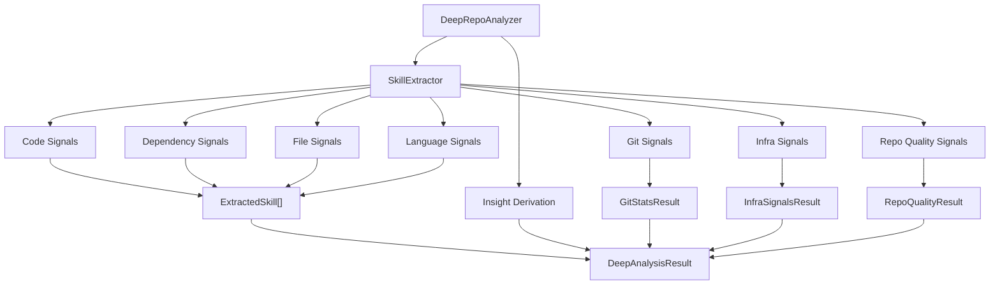

The Skill Detection system identifies technical skills from repository analysis using deterministic heuristics and pattern matching. It operates without requiring LLM access, with optional AI enhancement for summaries.

## Module Location

`src/artifactminer/skills/`

## Architecture Overview



## Core Components

### 1. DeepRepoAnalyzer

**File**: `deep_analysis.py`

**Class**: `DeepRepoAnalyzer`

**Location**: `src/artifactminer/skills/deep_analysis.py:22-177`

**Purpose**: Orchestrates skill extraction and derives higher-order insights.

#### Initialization

```python
analyzer = DeepRepoAnalyzer(enable_llm=False)
```

**Parameters**:
- `enable_llm`: Currently ignored (LLM disabled by design)

**Validation**: Checks that all insight rules reference valid skills (lines 147-155)

#### Analysis Method

**Signature**:
```python
def analyze(
    repo_path: str,
    repo_stat: Any,
    user_email: str,
    user_contributions: Dict | None = None,
    consent_level: str = "none",
    user_stats: Any = None,
) -> DeepAnalysisResult
```

**Location**: Lines 62-93

**Process**:

1. **Skill Extraction**
   ```python
   skills = self.extractor.extract_skills(
       repo_path=repo_path,
       repo_stat=repo_stat,
       user_email=user_email,
       user_contributions=user_contributions or {},
       consent_level=consent_level,
   )
   ```

2. **Insight Derivation**
   ```python
   insights = self._derive_insights(skills)
   ```

3. **Git Stats Extraction**
   ```python
   git_stats = self._extract_git_stats(
       repo_path, user_email, user_contributions, user_stats
   )
   ```

4. **Infrastructure Signals**
   ```python
   infra_signals = self._extract_infra_signals(repo_path, user_contributions)
   ```

5. **Repository Quality**
   ```python
   repo_quality = self._extract_repo_quality(repo_path, user_contributions)
   ```

**Returns**: `DeepAnalysisResult` containing:
- `skills`: List of `ExtractedSkill` objects
- `insights`: List of `Insight` objects
- `git_stats`: `GitStatsResult` or None
- `infra_signals`: `InfraSignalsResult` or None
- `repo_quality`: `RepoQualityResult` or None

#### Insight Rules

**Location**: Lines 26-56

Insights are derived from skill combinations:

```python
_INSIGHT_RULES: Dict[str, Dict[str, Any]] = {
    "Complexity awareness": {
        "skills": {"Resource Management"},
        "why": "Resource caps and chunking show attention to cost/complexity under load.",
    },
    "Data structure and optimization": {
        "skills": {"Advanced Collections", "Algorithm Optimization"},
        "why": "Specialized collections and optimization tools indicate performance-minded choices.",
    },
    "Abstraction and encapsulation": {
        "skills": {"Dataclass Design", "Abstract Interfaces", "Data Validation"},
        "why": "Structured modeling and interfaces reflect design thinking beyond scripts.",
    },
    "Robustness and error handling": {
        "skills": {"Exception Design", "Context Management", "Error Handling", "Logging"},
        "why": "Custom exceptions, managed resources, and logging reduce brittleness in failure scenarios.",
    },
    "Async and concurrency": {
        "skills": {"Asynchronous Programming"},
        "why": "Async patterns enable scalable, non-blocking operations.",
    },
    "API design and architecture": {
        "skills": {"REST API Design", "Dependency Injection", "Data Validation"},
        "why": "Clean API design with validation and DI shows architectural maturity.",
    },
}
```

**Derivation Logic** (lines 157-176):
```python
def _derive_insights(self, skills: List[ExtractedSkill]) -> List[Insight]:
    skill_map = {s.skill: s for s in skills}
    insights = []
    
    for title, rule in self._INSIGHT_RULES.items():
        matched = [skill_map[name] for name in rule["skills"] if name in skill_map]
        if not matched:
            continue
        
        # Collect evidence from matched skills
        evidence = []
        for skill in matched:
            evidence.extend(skill.evidence[:2])
        
        insights.append(Insight(
            title=title,
            evidence=evidence[:5],  # Keep top 5 evidence items
            why_it_matters=rule["why"],
        ))
    
    return insights
```

### 2. SkillExtractor

**File**: `skill_extractor.py`

**Class**: `SkillExtractor`

**Location**: `src/artifactminer/skills/skill_extractor.py:16-218`

**Purpose**: Heuristic skill extraction from multiple signal sources.

#### Extract Skills Method

**Signature**:
```python
def extract_skills(
    repo_path: str,
    repo_stat: Any,
    user_email: str,
    user_contributions: Dict | None = None,
    consent_level: str = "none",
    frameworks: List[str] | None = None,
    languages: List[str] | None = None,
) -> List[ExtractedSkill]
```

**Location**: Lines 23-145

**Process**:

#### 1. Validation (lines 36-51)

```python
if not repo_stat:
    raise ValueError("repo_stat is required")
if not hasattr(repo_stat, "is_collaborative"):
    raise ValueError("repo_stat.is_collaborative is required")
if not user_email:
    raise ValueError("user_email is required for skill extraction")

collab_flag = bool(getattr(repo_stat, "is_collaborative"))
user_profile = build_user_profile(repo_path, normalized_email) if collab_flag else None

if collab_flag and not user_profile:
    raise ValueError("No commits found for the specified user in this collaborative repo")
```

**Collaboration Handling**:
- Collaborative repo: Build user profile from Git history
- Solo repo: Use full repository analysis
- User profile contains: touched paths, file counts, additions text

#### 2. Language & Framework Signals (lines 66-118)

**File Extension Analysis**:
```python
file_counts = user_profile["file_counts"] if user_profile else count_files_by_ext(repo_path)
total_files = max(sum(file_counts.values()), 1)

for ext, count in file_counts.items():
    mapping = LANGUAGE_EXTENSIONS.get(ext)  # e.g., ".py" -> ("Python", "languages")
    if mapping:
        name, category = mapping
        evidence = [f"{count} {scope_label} *{ext} files detected"]
        proficiency = self._score(count, total_files)
        self._add_skill(skills, name, category, evidence, proficiency)
```

**Proficiency Scoring** (lines 167-169):
```python
def _score(self, count: int, total: int) -> float:
    ratio = count / total if total else 0
    return round(min(1.0, 0.35 + 0.65 * ratio), 2)
```

**Framework Detection**:
```python
for fw in frameworks:
    self._add_skill(
        skills,
        fw,
        CATEGORIES["frameworks"],
        [f"Dependency or config indicates {fw}"],
        0.62,
    )
```

#### 3. Dependency Signals (lines 123-130)

**Process**:
```python
for ecosystem in ecosystems | {"cross"}:
    for dep, (skill_name, category) in DEPENDENCY_SKILLS.get(ecosystem, {}).items():
        dep_hits = dependency_hits(repo_path, dep, touched_paths=touched_paths)
        if dep_hits:
            evidence = [f"{dep_hits} occurrence(s) of '{dep}' in {scope_hint}"]
            proficiency = min(0.8, 0.45 + 0.1 * dep_hits)
            self._add_skill(skills, skill_name, category, evidence, proficiency)
```

**Example**:
- Find "pytest" in `requirements.txt` → "Test-Driven Development" skill
- Find "docker" in manifests → "Containerization" skill

#### 4. Code Pattern Signals (lines 133-143)

**Process**:
```python
additions_text = collect_additions_text(user_contributions)

for pattern, hits in iter_code_pattern_hits(additions_text, ecosystems):
    evidence = [f"{pattern.evidence} ({hits} match{'es' if hits != 1 else ''})"]
    prof = min(0.9, pattern.weight + 0.05 * hits)
    self._add_skill(skills, pattern.skill, pattern.category, evidence, prof)
```

**Example Pattern** (from `skill_patterns.py`):
```python
CodePattern(
    skill="Asynchronous Programming",
    category="advanced_techniques",
    regex=r"\basync\s+def\b",
    evidence="Uses async/await patterns",
    weight=0.7,
    ecosystems=["python"],
)
```

### 3. Signal Extractors

#### Code Signals

**File**: `signals/code_signals.py`

**Function**: `iter_code_pattern_hits(additions_text, ecosystems)`

**Location**: Lines 23-31

**Process**:
```python
for pattern in CODE_REGEX_PATTERNS:
    # Check ecosystem gate
    if pattern.ecosystems:
        if not ecosystems.intersection(set(pattern.ecosystems)):
            continue
    
    # Count regex matches
    hits = len(re.findall(pattern.regex, additions_text, flags=re.MULTILINE))
    if hits:
        yield pattern, hits
```

**Pattern Examples** (from `skill_patterns.py`):

```python
# Exception handling
CodePattern(
    skill="Exception Design",
    category="error_handling",
    regex=r"\bclass\s+\w+Exception\s*\(",
    evidence="Defines custom exception classes",
    weight=0.65,
)

# Context management
CodePattern(
    skill="Context Management",
    category="advanced_techniques",
    regex=r"\bwith\s+\w+.*\bas\s+\w+:",
    evidence="Uses context managers (with statements)",
    weight=0.6,
    ecosystems=["python"],
)

# REST API Design
CodePattern(
    skill="REST API Design",
    category="backend",
    regex=r"@(app|router|api)\.(get|post|put|delete|patch)",
    evidence="Defines REST API endpoints",
    weight=0.75,
    ecosystems=["python"],
)
```

#### Dependency Signals

**File**: `signals/dependency_signals.py`

**Function**: `dependency_hits(repo_path, needle, touched_paths=None)`

**Location**: Lines 11-37

**Process**:
```python
manifests = [
    "pyproject.toml", "requirements.txt", "Pipfile",
    "package.json", "go.mod", "pom.xml",
    "build.gradle", "build.gradle.kts",
]

total_hits = 0
for manifest in manifests:
    # Skip if user didn't touch this file (in collaborative repos)
    if touched_paths and manifest not in touched_paths:
        continue
    
    target = Path(repo_path) / manifest
    if target.exists():
        content = target.read_text().lower()
        total_hits += content.count(needle.lower())

return total_hits
```

**Example Mappings** (from `mappings.py`):
```python
DEPENDENCY_SKILLS = {
    "python": {
        "pytest": ("Test-Driven Development", "testing"),
        "fastapi": ("FastAPI", "frameworks"),
        "sqlalchemy": ("SQLAlchemy", "frameworks"),
        "pydantic": ("Data Validation", "best_practices"),
    },
    "javascript": {
        "jest": ("Test-Driven Development", "testing"),
        "react": ("React", "frameworks"),
        "express": ("Express", "frameworks"),
    },
    "cross": {
        "docker": ("Containerization", "devops"),
        "kubernetes": ("Kubernetes", "devops"),
    },
}
```

#### File Signals

**File**: `signals/file_signals.py`

**Purpose**: Detect skills from file structure patterns (config files, directory layout, etc.)

#### Git Signals

**File**: `signals/git_signals.py`

**Functions**:
- `get_git_stats()`: Extract commit metrics
- `detect_git_patterns()`: Detect branching, tagging, merge patterns

**Returns**: `GitStatsResult` with:
- `commit_count_window`: Commits in last 90 days
- `commit_frequency`: Commits per week
- `contribution_percent`: User's contribution %
- `has_branches`: Whether repo uses branches
- `branch_count`: Number of branches
- `has_tags`: Whether repo uses tags
- `merge_commits`: Count of merge commits

#### Infrastructure Signals

**File**: `signals/infra_signals.py`

**Function**: `get_infra_signals(repo_path, touched_paths=None)`

**Detects**:
- **CI/CD**: `.github/workflows/`, `.gitlab-ci.yml`, `Jenkinsfile`
- **Docker**: `Dockerfile`, `docker-compose.yml`
- **Build/Deploy**: `Makefile`, `webpack.config.js`, `.env`

**Returns**: `InfraSignalsResult` with:
- `ci_cd_tools`: List of CI/CD tools
- `docker_tools`: List of Docker-related files
- `env_build_tools`: List of build/env tools
- `all_tools`: Combined list

#### Repository Quality Signals

**File**: `signals/repo_quality_signals.py`

**Function**: `get_repo_quality_signals(repo_path, touched_paths=None)`

**Detects**:
- **Testing**: Test files, test frameworks (pytest, jest, etc.)
- **Documentation**: README, CHANGELOG, CONTRIBUTING, docs/
- **Code Quality**: Lint configs, pre-commit hooks, type checking

**Returns**: `RepoQualityResult` with:
- `test_file_count`: Number of test files
- `has_tests`: Boolean
- `test_frameworks`: List of frameworks
- `has_readme`, `has_changelog`, `has_contributing`, `has_docs_dir`: Booleans
- `has_lint_config`, `has_precommit`, `has_type_check`: Booleans
- `quality_tools`: List of quality tools

#### Language Signals

**File**: `signals/language_signals.py`

**Function**: `count_files_by_ext(repo_path)`

**Returns**: Dictionary of extension counts

```python
{
    ".py": 45,
    ".js": 23,
    ".md": 5,
    ".json": 3,
}
```

## Skill Models

**File**: `models.py`

**Location**: `src/artifactminer/skills/models.py`

### ExtractedSkill

**Dataclass** (lines 7-23):
```python
@dataclass
class ExtractedSkill:
    skill: str  # e.g., "Python", "React", "REST API Design"
    category: str  # e.g., "languages", "frameworks", "backend"
    evidence: List[str]  # Evidence snippets
    proficiency: float  # 0.0 to 1.0
    
    def add_evidence(self, items: Iterable[str]) -> None:
        """Append unique evidence snippets."""
        deduped = set(self.evidence)
        for item in items:
            if item not in deduped:
                self.evidence.append(item)
                deduped.add(item)
```

### Insight

**Dataclass** (lines 42-49):
```python
@dataclass
class Insight:
    title: str  # e.g., "API design and architecture"
    evidence: List[str]  # Supporting evidence
    why_it_matters: str  # Explanation of significance
```

### GitStatsResult

**Dataclass** (lines 51-64):
```python
@dataclass
class GitStatsResult:
    commit_count_window: int = 0
    commit_frequency: float = 0.0
    contribution_percent: float = 0.0
    first_commit_date: Any = None
    last_commit_date: Any = None
    has_branches: bool = False
    branch_count: int = 0
    has_tags: bool = False
    merge_commits: int = 0
```

### InfraSignalsResult

**Dataclass** (lines 66-74):
```python
@dataclass
class InfraSignalsResult:
    ci_cd_tools: List[str] = field(default_factory=list)
    docker_tools: List[str] = field(default_factory=list)
    env_build_tools: List[str] = field(default_factory=list)
    all_tools: List[str] = field(default_factory=list)
```

### RepoQualityResult

**Dataclass** (lines 26-40):
```python
@dataclass
class RepoQualityResult:
    test_file_count: int = 0
    has_tests: bool = False
    test_frameworks: List[str] = field(default_factory=list)
    has_readme: bool = False
    has_changelog: bool = False
    has_contributing: bool = False
    has_docs_dir: bool = False
    has_lint_config: bool = False
    has_precommit: bool = False
    has_type_check: bool = False
    quality_tools: List[str] = field(default_factory=list)
```

### DeepAnalysisResult

**Dataclass** (lines 76-85):
```python
@dataclass
class DeepAnalysisResult:
    skills: List[ExtractedSkill]
    insights: List[Insight]
    git_stats: GitStatsResult | None = None
    infra_signals: InfraSignalsResult | None = None
    repo_quality: RepoQualityResult | None = None
```

## Skill Persistence

**File**: `persistence.py`

Skills are persisted to three database tables:

1. **`skills`**: Global skill catalog
   - Unique skill names
   - Categories

2. **`project_skills`**: Project ↔ Skill links
   - Proficiency scores
   - Evidence JSON
   - Weight values

3. **user_project_skills**: User ↔ Project ↔ Skill links
   - For collaborative repositories
   - User-scoped proficiency and evidence

## Example Workflow

```python
from artifactminer.skills.deep_analysis import DeepRepoAnalyzer
from artifactminer.RepositoryIntelligence.repo_intelligence_main import getRepoStats

# 1. Get repository statistics
repo_stat = getRepoStats("/path/to/repo")

# 2. Initialize analyzer
analyzer = DeepRepoAnalyzer()

# 3. Analyze repository
result = analyzer.analyze(
    repo_path="/path/to/repo",
    repo_stat=repo_stat,
    user_email="alice@example.com",
    consent_level="none",
)

# 4. Access results
print(f"Found {len(result.skills)} skills:")
for skill in result.skills:
    print(f"  - {skill.skill} (proficiency: {skill.proficiency:.2f})")
    print(f"    Category: {skill.category}")
    print(f"    Evidence: {skill.evidence[0] if skill.evidence else 'N/A'}")

print(f"\nDerived {len(result.insights)} insights:")
for insight in result.insights:
    print(f"  - {insight.title}")
    print(f"    Why: {insight.why_it_matters}")
```

## Related Documentation

- [System Architecture](/architecture/overview)
- [Data Flow Architecture](/architecture/data-flow)
- [Database Architecture](/architecture/database)
- [Repository Intelligence](/architecture/repository-intelligence)
- [Evidence Extraction](/architecture/evidence-extraction)
