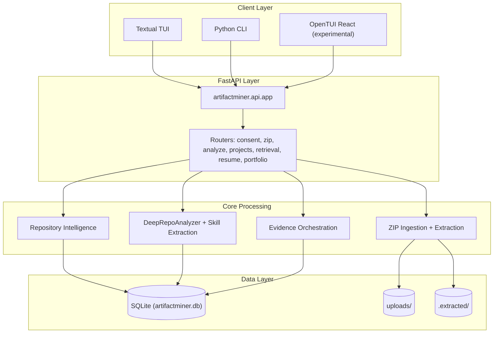

## What is Artifact Miner?

Artifact Miner is an intelligent portfolio analysis tool that analyzes uploaded project ZIP files, discovers Git repositories, extracts repository and user contribution intelligence, derives skills and evidence, and builds resume/portfolio-ready outputs.

Instead of manually reviewing dozens of student projects or struggling to articulate your technical experience, Artifact Miner automates the discovery and synthesis of:

- **Repository intelligence**: Languages, frameworks, commit history, collaboration patterns, and health scores
- **User contribution analytics**: Individual commit activity, contribution percentages, and role detection
- **Skills chronology**: When you first demonstrated each skill, organized by category
- **Project evidence**: Concrete proof of technical capabilities extracted from your work
- **Resume-ready outputs**: Structured summaries and timeline visualizations

## Who is Artifact Miner for?

<CardGroup cols={3}>
  <Card title="CS Students" icon="graduation-cap">
    Transform your academic projects into professional portfolio artifacts. Generate resume bullets backed by real code evidence.
  </Card>
  
  <Card title="Teaching Assistants" icon="chalkboard-user">
    Quickly assess student portfolios at scale. Identify collaboration patterns, contribution levels, and technical breadth.
  </Card>
  
  <Card title="Career Advisors" icon="briefcase">
    Help students articulate their technical experience. Extract concrete skills and project timelines for career planning.
  </Card>
</CardGroup>

## Key Capabilities

### Multi-ZIP Portfolio Analysis

Artifact Miner supports analyzing multiple project archives under a single portfolio:

- Upload one or more ZIP files containing your projects
- Automatically discover Git repositories within uploaded archives
- Link related projects through `portfolio_id` tracking
- Generate unified insights across all your work

### Repository Intelligence

For each discovered Git repository, Artifact Miner computes:

<AccordionGroup>
  <Accordion title="Language & Framework Detection">
    - Primary and secondary languages with usage percentages
    - Framework identification (React, Flask, FastAPI, etc.)
    - Technology stack visualization
  </Accordion>
  
  <Accordion title="Commit & Collaboration Metrics">
    - First and last commit timestamps
    - Total commit count and commit frequency
    - Collaboration detection (single vs. multi-contributor)
    - User contribution percentages
  </Accordion>
  
  <Accordion title="Repository Health Score">
    - Health indicator (0-100) based on commit patterns
    - Project ranking scores
    - Activity classification (recent vs. inactive)
  </Accordion>
</AccordionGroup>

### Skills & Evidence Extraction

The **DeepRepoAnalyzer** inspects your codebase and extracts:

- **Skill signals**: Language proficiency, framework usage, tool familiarity
- **Evidence artifacts**: Specific files, commits, or patterns proving skill application
- **Chronological tracking**: When each skill was first and last demonstrated
- **Proficiency levels**: Derived from code complexity and usage patterns

### LLM-Enhanced Insights (Optional)

With user consent, Artifact Miner can leverage LLM integrations for:

- AI-generated project summaries
- Natural language skill descriptions
- Resume item suggestions

<Note>
  LLM usage requires explicit consent. You can choose **local** (Ollama), **cloud** (OpenAI), or **no LLM** analysis paths.
</Note>

## System Architecture

Artifact Miner consists of three layers:

<Tip>
  All clients (TUI, CLI, React) communicate with the same FastAPI backend, ensuring consistent analysis regardless of interface choice.
</Tip>

## Data Flow

When you upload a project ZIP, Artifact Miner follows this pipeline:

<Steps>
  <Step title="Consent & User Config">
    Capture consent preferences and analysis context (email, goals, file filters)
  </Step>
  
  <Step title="ZIP Intake">
    Store uploaded ZIPs and prepare extraction paths for analysis
  </Step>
  
  <Step title="Repo Discovery & Analysis">
    Find Git repositories and compute repository/user contribution statistics
  </Step>
  
  <Step title="Skills + Evidence + Ranking">
    Derive skill signals, insights, repository quality evidence, and ranking scores
  </Step>
  
  <Step title="Retrieval + Portfolio Assembly">
    Serve timeline/skills/resume/summaries and build portfolio-scoped outputs
  </Step>
</Steps>

## Next Steps

<CardGroup cols={2}>
  <Card title="Quickstart" icon="bolt" href="/quickstart">
    Get up and running in 5 minutes with a test portfolio
  </Card>
  
  <Card title="Installation" icon="download" href="/installation">
    Detailed setup guide for local development
  </Card>
</CardGroup>
